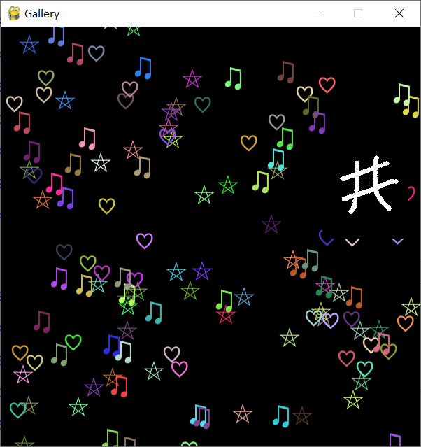

# Interactive Recognition System with Siamese networks

An interesting interactive character recognition system.

You can try to enter any text.

But when you enter ♡, ♢, ♫, ⛤, ✕ and numbers, something interesting may happen.


## Run

```bash
python ./Main_GUI.py
```


## Command

| Key   | Action                       |
| ----- | ---------------------------- |
| s     | View and save cropped images |
| c     | Clear the handwriting pad    |
| Enter | Run                          |
| ESC   | Quit                         |


## Effect example




Created by Hongkun Xu in January 2021.